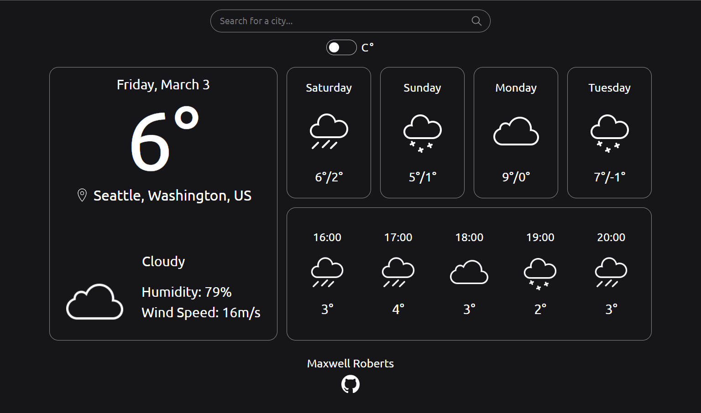
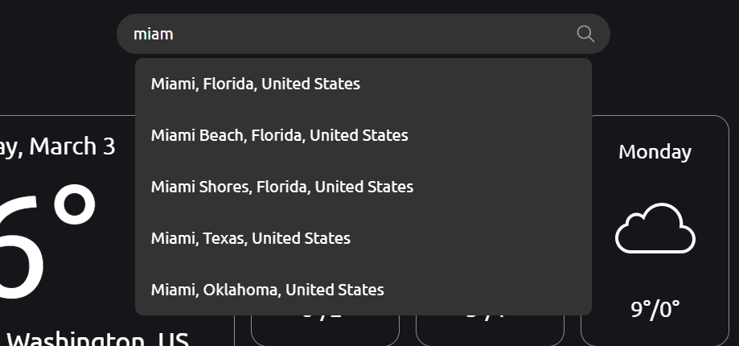

# Weather Dashboard
https://robertsmaxwell.github.io/weather

Online weather dashboard, displays basic weather data along with a daily and hourly forecast.

  

## Notable features

* Utilizes Open Meteo open source weather API
* Uses Geoapify city autocomplete API for city search
* Allows for switching between fahrenheit and celsius

  

